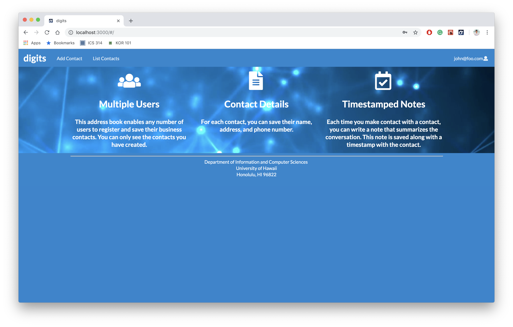

# **digits**




## **Installation**
**First,** install <a href="https://www.meteor.com/install">Meteor</a>.

**Second,** clone/download this <a href="https://github.com/liukeving/digits">Github repo</a>.

**Third,** `cd` into the app directory and install the required libraries with:

`$ meteor npm install`

After installation, you can run the application by invoking the "start" script in the package.json file with:

`$ meteor npm run start`

When running the application, you will get the following message:
```
Note: you are using a pure-JavaScript implementation of bcrypt.
While this implementation will work correctly, it is known to be
approximately three times slower than the native implementation.
In order to use the native implementation instead, run
   
     meteor npm install --save bcrypt
   
in the root directory of your application.
```
You can just ignore that message as the application will still run.

**Finally,** the template application will appear at http://localhost:3000.

You can run ESLint over the code in the imports/ directory with:

`meteor npm run lint`

## Pages Walkthrough
### Landing
The Landing page contains the introduction of the application, detailing the benefits of utilizing this page with its multiple user interface, saved contact details, and time-stamped notes.

### Account Settings
The application allows users to create an account, sign-in on their account, and sign-out of their account. These accounts hold their specific contacts and time-stamped notes.

### Add Contact
The Add Contact page lets users create a new contact by inputting their first name, last name, address, image, and description. A popup alert will notify the user if the contact has been added successfully or not.

### List Contacts
This page lists all the owner-created contacts on here. In this page, users can edit an existing contact information and/or add time-stamped notes.

### Admin
This page is only specific for the admin users, allowing admins to view all the contacts created as well as who created them. 